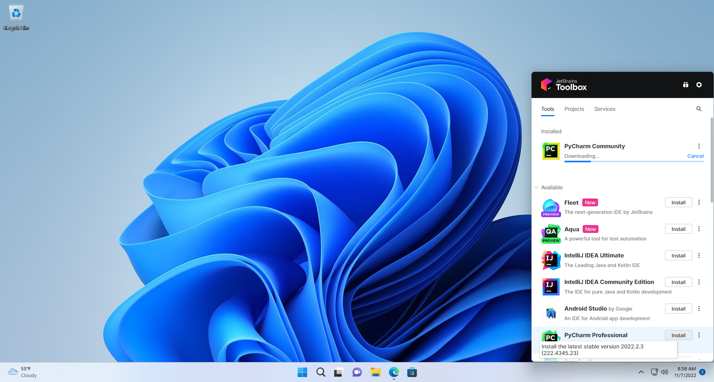
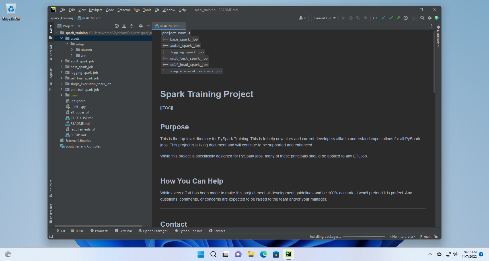
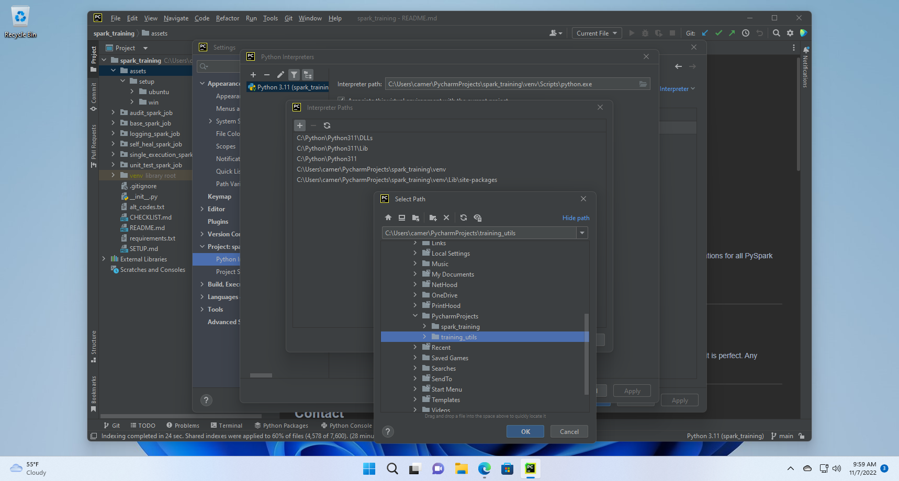
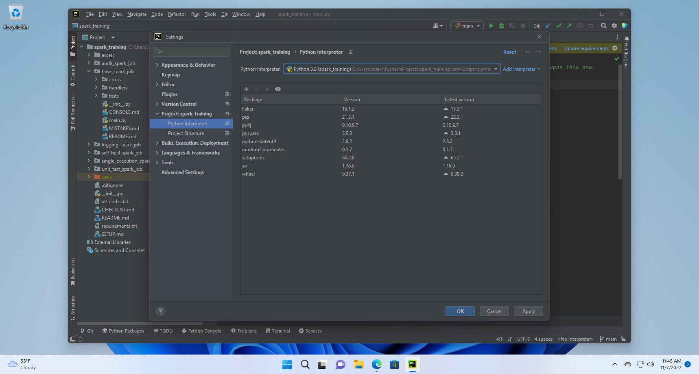
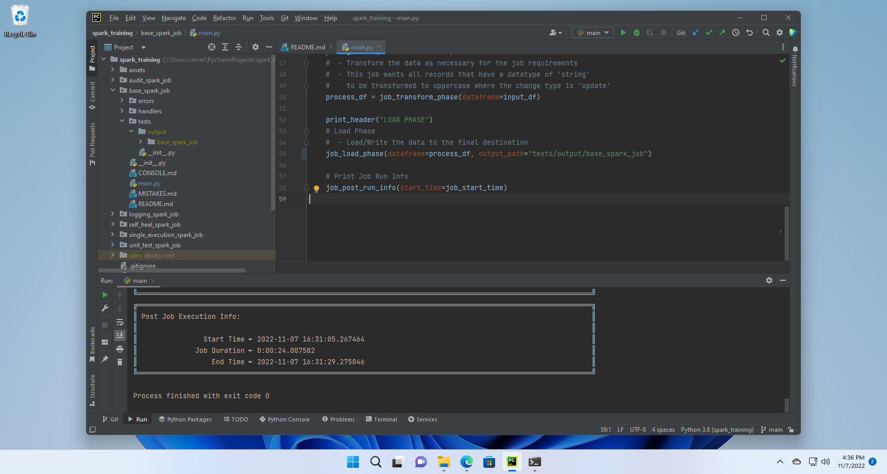
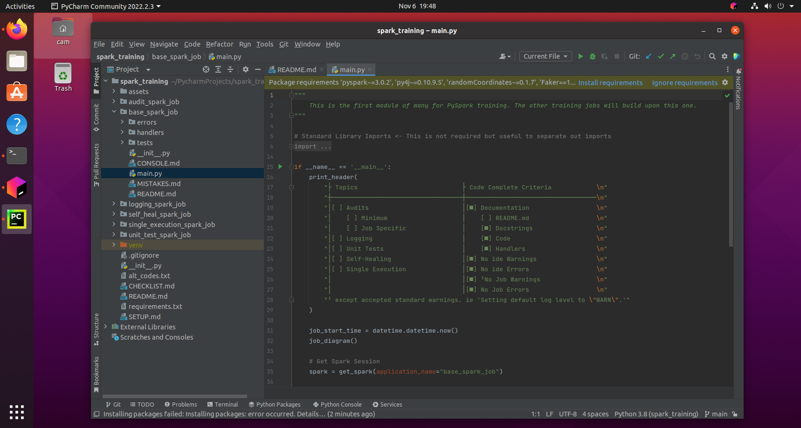
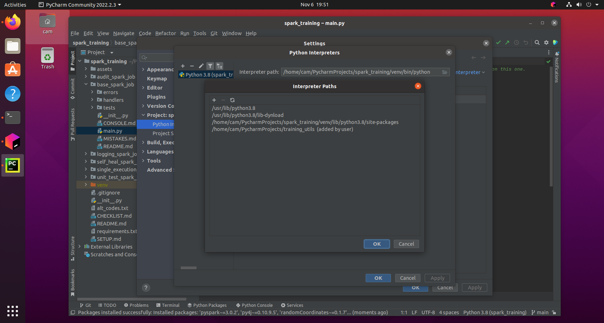
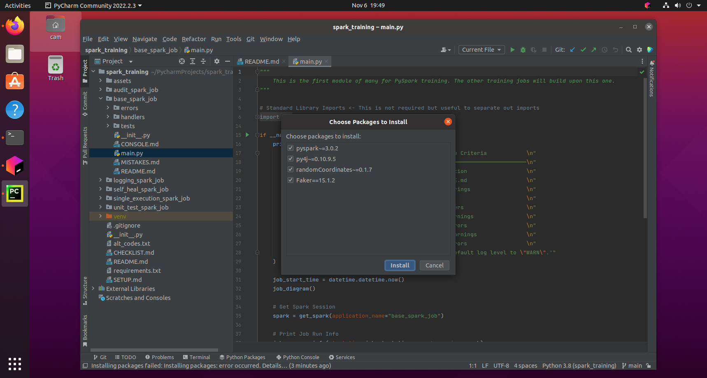
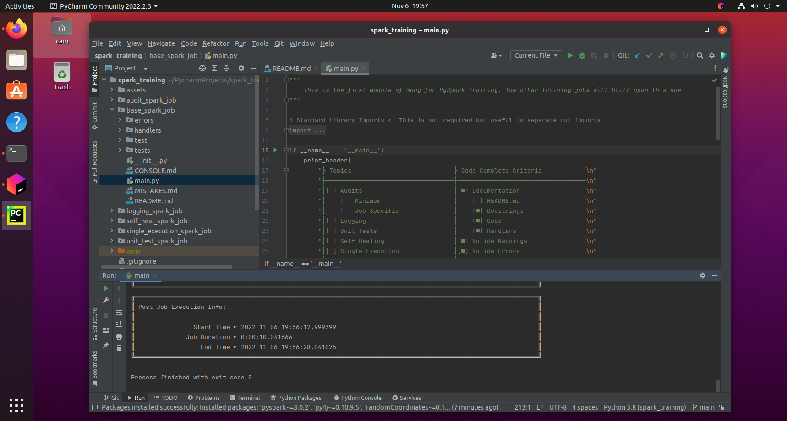

# Tested Versions

| Key               | Value                             |
|-------------------|-----------------------------------|
| OS                | Win 10, Win 11, Ubuntu 20.04      |
| IDE               | PyCharm 2022.1, 2022.2            |
| Python            | 3.8, 3.10                         |
| JDK               | openJDK 1.8.0-262, Java 1.8.0_351 |
| PySpark           | 3.0.2, 3.0.3, 3.2.2               |
| randomCoordinates | 0.1.7                             |
| Faker             | 15.1.1, 15.1.2                    |

# Assumptions

It is assumed that the user of these instructions has some knowledge of Spark/PySpark, Python, Python Packages, Python
Interpreters, PyCharm, and Java. This setup guide is a summary of steps needed to be taken rather than a comprehensive
step-by-step guide.

# Install & Configure

These projects will largely run the same in Windows and Ubuntu once you have the OS dependencies installed and
configured. More system dependencies exist in the Windows OS making it longer to get up and running. These steps have
been included below.

The steps below were generated from new a new virtual machine for Windows 11 and Ubuntu 20 using VMware Workstation.
General steps follow this pattern:

1. Install OS ([Windows](#Windows), [Ubuntu](#Ubuntu))
2. Install [JetBrains PyCharm](https://www.jetbrains.com/pycharm/) - The IDE to run the code in
3. Install [Git](https://git-scm.com/) - The version control tool of choice
4. Install [Python](https://www.python.org/) 3 - The language the PySpark jobs are written in
5. Install [JDK](https://www.oracle.com/java/) - The engine that Spark runs in
6. Install OS specific items
7. Clone repositories for `training_utils` and `spark_training` - The two projects used in this PySpark training project
8. Open and configure `spark_training` job in PyCharm - Setup PyCharm with the required Python packages
9. Run [PySpark](https://spark.apache.org/) job

## Windows

1. Install Windows 11
2. Install [JetBrains Toolbox](https://www.jetbrains.com/toolbox-app/)
    1. Install [PyCharm](https://www.jetbrains.com/pycharm/) 2022.2 via toolbox 
       
3. Install [Git](https://git-scm.com/)
    - [Git Downloads](https://git-scm.com/downloads)
4. Install [Python](https://www.python.org/) 3
    - [Python Downloads](https://www.python.org/downloads/release/python-380/)
    - Install to `C:\Python\Python38\ `
    - Add to `PATH`
5. Install [JDK](https://www.oracle.com/java/) 8
    - [OpenJDK 8](https://www.oracle.com/java/technologies/downloads/#java8-windows)
    - Install JDK to `C:\Java\jdk1.8.0_351\ `
    - Install JRE to `C:\Java\jre\ `
6. Install WinUtils
    - [WinUtils](https://github.com/cdarlint/winutils)
    - Save `winutils.exe` to `C:\hadoop\bin\ `
    - Add `HADOOP_HOME` environment variable with path `C:\hadoop\ `
    - Add `%HADOOP_HOME%\bin` to `PATH`
7. Install hadoop.dll

    - [ ] Verify if needed - I have never had to do this in my other installs. Maybe this is because I usually install
      PySpark locally instead
      of using pip.
    - [WinUtils](https://github.com/cdarlint/winutils)
    - Copy `hadoop.dll`, from the same location as `winutils.exe`, to `C:\Windows\System32\ `
8. Install Visual C++

    - [ ] Verify if needed - I am not sure if this is needed. I ran into write parquet errors and this was one suggested
      fix.
    - x86 & x64 [Microsoft Visual C++](https://www.microsoft.com/en-au/download/details.aspx?id=26999)
10. Clone `training_utils`
    - `git clone https://github.com/mrperson2015/training_utils.git`
11. Clone `spark_training`
    - `git clone https://github.com/mrperson2015/spark_training.git`
12. Open project `spark_training` in PyCharm 
    
    1. Setup Interpreter
    2. Add user interpreter `training_utils`
       [training_utils](https://github.com/mrperson2015/training_utils) 
       
    3. Install required packages 
       
    4. Run `base_spark_job/main.py` 
       

## Ubuntu

1. Install [Ubuntu](https://ubuntu.com/) 20.04.5 LTS
2. Install [JetBrains Toolbox](https://www.jetbrains.com/toolbox-app/)
    1. Install [PyCharm](https://www.jetbrains.com/pycharm/) 2022.2 via toolbox
3. Install [Git](https://git-scm.com/)
    - `sudo apt install git`
4. Install [Pip](https://pip.pypa.io/en/stable/)
    - `sudo apt install python3-pip`
5. Install [JDK](https://www.oracle.com/java/) 8
    - `sudo apt install openjdk-8-jre-headless`
6. Clone `training_utils`
    - `git clone https://github.com/mrperson2015/training_utils.git`
7. Clone `spark_training`
    - `git clone https://github.com/mrperson2015/spark_training.git`
8. Open project `spark_training` in PyCharm 
   
    1. Setup interpreter
    2. Add user interpreter to `training_utils` 
       
    3. Install required packages 
       
    4. Run `base_spark_job/main.py` 
       
