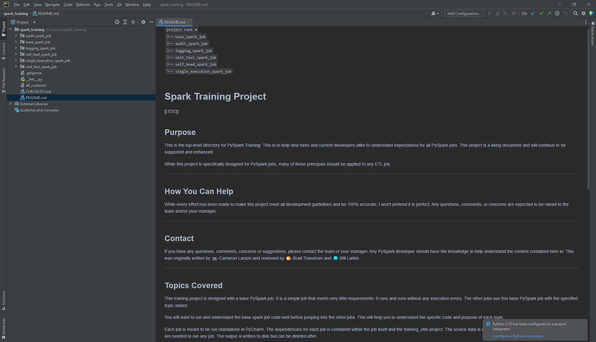
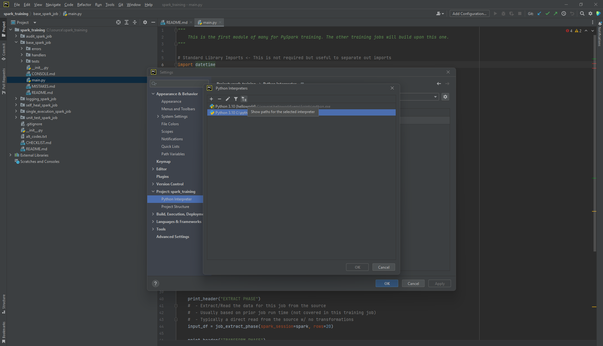

# Tested Versions

| Key               | Value                        |
|-------------------|------------------------------|
| OS                | Win 10, Win 11, Ubuntu 20.04 |
| IDE               | PyCharm 2022.1, 2022.2       |
| Python            | 3.8, 3.10                    |
| JDK               | openJDK 1.8.0-262            |
| PySpark           | 3.0.2, 3.0.3, 3.2.2          |
| randomCoordinates | 0.1.7                        |
| Faker             | 15.1.1, 15.1.2               |

```shell
C:\source>java -version
openjdk version "1.8.0-262"
OpenJDK Runtime Environment (build 1.8.0-262-b10)
OpenJDK 64-Bit Server VM (build 25.71-b10, mixed mode)
```

# Training Utils

## Clone Repo

You are here -> [training_utils](https://github.com/mrperson2015/training_utils)

```shell
C:\source>git clone https://github.com/mrperson2015/training_utils.git
Cloning into 'training_utils'...
remote: Enumerating objects: 21, done.
remote: Counting objects: 100% (21/21), done.
remote: Compressing objects: 100% (13/13), done.
Receiving objects:  76% (16/21)sed 20 (delta 4), pack-reused 0
Receiving objects: 100% (21/21), 13.58 KiB | 3.40 MiB/s, done.
Resolving deltas: 100% (5/5), done.

C:\source>
```

# Spark Training

## Clone Repo

This project has a dependency to the project `training_utils` found
at [training_utils](https://github.com/mrperson2015/training_utils)

You are here -> [spark_training](https://github.com/mrperson2015/spark_training.git)

```shell
C:\source>git clone https://github.com/mrperson2015/spark_training.git
Cloning into 'spark_training'...
remote: Enumerating objects: 124, done.
remote: Counting objects: 100% (124/124), done.
remote: Compressing objects: 100% (81/81), done.
remote: Total 124 (delta 64), reused 101 (delta 41), pack-reused 0Receiving objects:  56% (70/124)
Receiving objects: 100% (124/124), 29.78 KiB | 376.00 KiB/s, done.
Resolving deltas: 100% (64/64), done.

C:\source>cd spark_training
```

## Setup

### Windows

1. Open project `spark_training` in PyCharm<br>
   [](./assets/setup/win/open_job.png)
2. Setup `venv`
    1. Include user added interpreter to the
       project [training_utils](https://github.com/mrperson2015/training_utils)<br>
       [](./assets/setup/win/setup_venv.png)
3. Install Dependencies<br>
   See versions above if you want to follow the same versions used during development

    1. `training_utils`
    2. PySpark
    3. randomCoordinates
    4. Faker

### Ubuntu
These steps where completed in a virtual machine using VMWare

1. Install Ubuntu 22.04
2. Install [JetBrains Toolbox](https://www.jetbrains.com/toolbox-app/)
    1. Install PyCharm 2022.2 (latest) via toolbox
3. Install Git
    - `sudo apt install git`
4. Install Pip
    - `sudo apt install python3-pip`
5. Install JDK 8
    - `sudo apt install openjdk-8-jre-headless`
6. Clone `training_utils`
    - `git clone https://github.com/mrperson2015/training_utils.git`
7. Clone `spark_training`
    - `git clone https://github.com/mrperson2015/spark_training.git`
8. Open `spark_training` project<br>
   [](./assets/setup/ubuntu/base_spark_job_main.png)
    1. Setup interpreter
    2. add user interpreter to `training_utils`<br>
       [](./assets/setup/ubuntu/setup_interpreter.png)
    3. install required packages<br>
       [](./assets/setup/ubuntu/package_requirements.png)
    4. run `base_spark_job/main.py`<br>
       [](./assets/setup/ubuntu/job_complete.png)